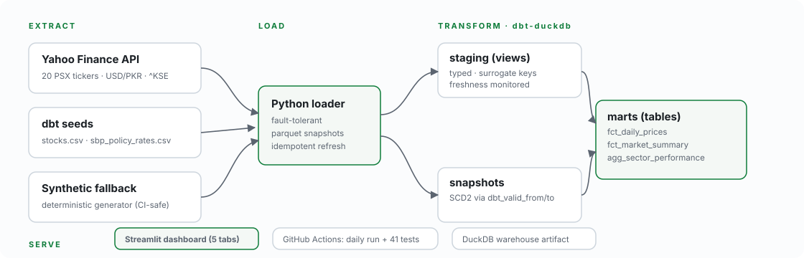
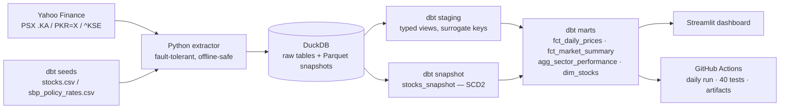
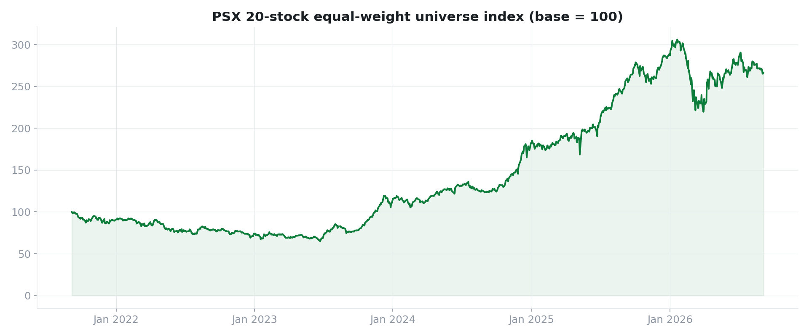
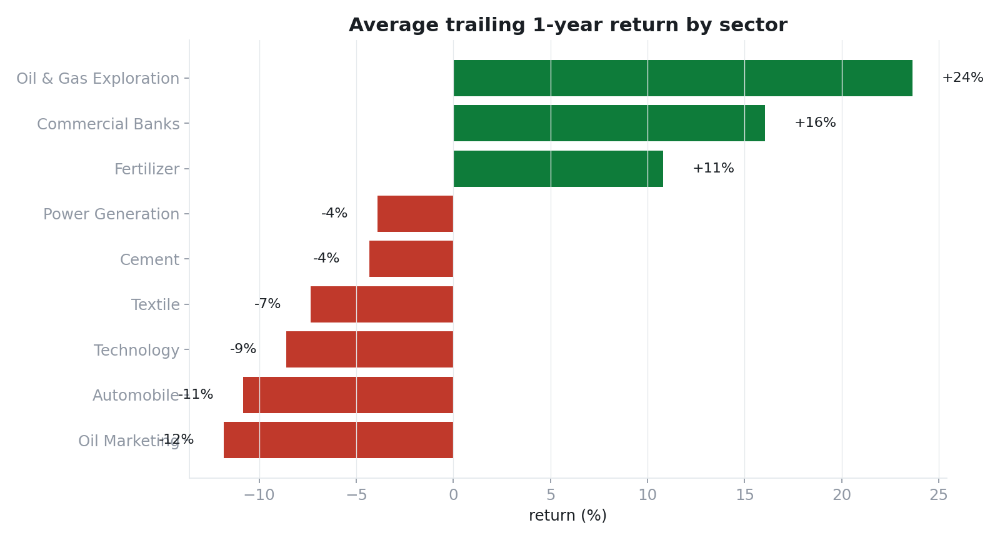
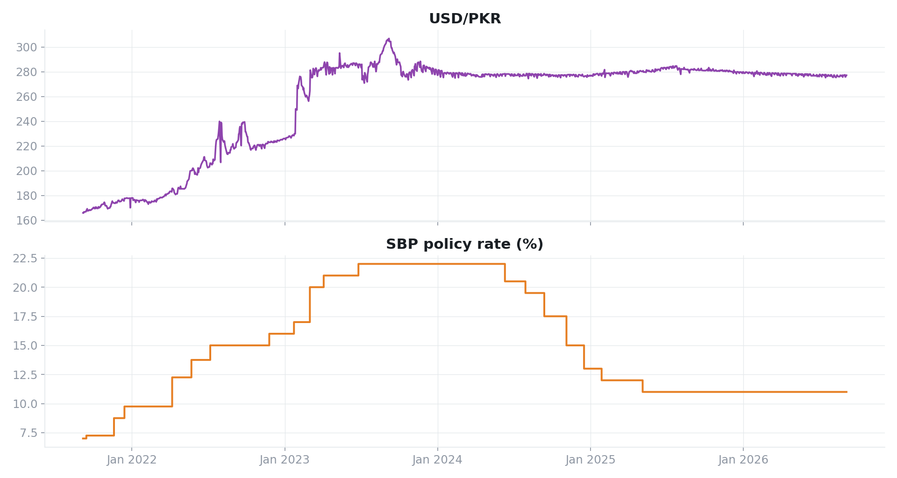

# PSX Analytics — Pakistan Stock Exchange Data Warehouse

**Built by [Umer Iqbal](https://github.com/Bilalkhank10) · Data Analyst & Analytics Engineer · Islamabad, Pakistan**

> An end-to-end analytics engineering project: live market data extraction →
> DuckDB warehouse → dbt transformation layer (SCD2, 40 tests, freshness
> monitoring) → an interactive Streamlit dashboard, refreshed daily by CI.

**Stack:** `Python` · `yfinance` · `DuckDB` · `dbt-duckdb` · `Streamlit` · `Plotly` · `GitHub Actions`



---

## What it covers

| | |
|---|---|
| Universe | **20 PSX large-caps** across 9 sectors (banks, E&P, cement, fertilizer, tech, power, textile, auto, OMC) |
| History | **~24,600 daily OHLCV rows**, Sep 2021 → today |
| Macro context | **USD/PKR** daily FX + **SBP policy rate** change events (seeded series) |
| Benchmark | Official **KSE-100** closes where the upstream feed is alive; equal-weight universe index everywhere |
| Models | 8 dbt models (staging views → mart tables) + 2 seeds + 1 snapshot |
| Quality | **40 automated tests**, 2 freshness monitors, 1 deliberate anomaly monitor |
| Serve | 5-tab Streamlit dashboard + presentation PNGs |

## Architecture



## Quickstart

```bash
git clone https://github.com/Bilalkhank10/psx-data-warehouse.git && cd psx-data-warehouse
pip install -r requirements.txt

python ingestion/run_ingestion.py --offline-if-fail   # live data; synthetic fallback if offline
cd dbt && dbt seed --profiles-dir . && dbt snapshot --profiles-dir . && dbt build --profiles-dir .

streamlit run ../dashboard/app.py          # http://localhost:8501
```

No API keys, no cloud account — DuckDB + Yahoo Finance keep the whole project
free and fully local.

## Highlights for reviewers

**1. A fact table built like a data product.**
`fct_daily_prices` ships daily returns, 7/30-day moving averages,
annualised 30-day realised volatility, rolling 52-week highs with drawdown, and
**USD-translated closes via an ASOF join** against the FX table (weekend/holiday
safe) — the metrics a real quant or treasury desk reaches for.

**2. Anomalies are flagged and measured, never silently dropped.**
Yahoo's corporate-action adjustment flaps around split/bonus dates, printing
impossible ±50–400% single-day "returns" (14 rows verified in LUCK / SYS / UBL
during 2025). The pipeline flags them (`is_return_outlier`), a dedicated singular
test (`assert_daily_returns_within_band`, severity = warn) monitors for *new*
ones, and market-level aggregates exclude them. This is a data-quality story,
not a hidden data hack.

**3. Real SCD2, demonstrated.**
Company metadata is versioned with `dbt snapshot` (`timestamp` strategy). The
repo ships with TRG carrying two versions — a rename closes the old validity
window (`dbt_valid_to`) and opens a new one. Edit any row in
`seeds/stocks.csv`, bump `updated_at`, re-run `dbt seed && dbt snapshot`, and
watch history accumulate.

**4. Graceful degradation, by design.**
- Yahoo's `^KSE` feed went stale upstream — the pipeline detects this and the
  dashboard falls back to a documented equal-weight reconstruction.
- CI runs are hermetic: pull requests build against a deterministic synthetic
  generator (seed = 42), so the 40-test suite is stable without network access.

**5. Freshness as a first-class concern.**
Every raw table carries `loaded_at`; `dbt source freshness` warns at 36 h and
errors at 96 h — exactly what you'd wire to a pager in production.

## Data sources

| Source | Content | Access |
|---|---|---|
| Yahoo Finance (`*.KA`) | Daily OHLCV, 20 PSX tickers, ~5y | `yfinance`, no key |
| Yahoo Finance (`PKR=X`) | USD/PKR daily close | `yfinance`, no key |
| Yahoo Finance (`^KSE`) | Official KSE-100 closes (feed stale upstream; handled gracefully) | `yfinance`, no key |
| `seeds/sbp_policy_rates.csv` | SBP policy-rate change events 2020–2025 | curated from SBP announcements — verify latest |
| `seeds/stocks.csv` | Stock universe master data | hand-curated |

## Model layer

```
staging/                     marts/
├─ stg_psx_prices            ├─ fct_daily_prices        (symbol × date)
├─ stg_fx_rates              ├─ fct_market_summary      (date)
├─ stg_policy_rates          ├─ agg_sector_performance  (sector)
└─ stg_market_index          └─ dim_stocks              (SCD2, from snapshot)
seeds/ stocks · sbp_policy_rates        snapshots/ stocks_snapshot
tests/ assert_daily_returns_within_band (severity: warn)
```

## CI/CD

`.github/workflows/daily_pipeline.yml`:
- **Mon–Fri 08:00 PKT:** live ingestion → `dbt seed` → `dbt snapshot` →
  `dbt build` (models + tests) → `dbt source freshness` → warehouse uploaded
  as a build artifact.
- **Every PR:** offline synthetic ingestion + full build & test suite.

## Dashboard





Five tabs: **Market** (index + breadth + top movers), **Stock explorer**
(candlestick + MA + drawdown/vol KPIs), **Sectors** (trailing returns + return
correlation heatmap), **Macro** (USD/PKR, policy rate, USD-adjusted price
comparisons), **Data quality** (anomaly register + freshness).

## Repo layout

```
psx-data-warehouse/
├── ingestion/            # extract + load (live or synthetic)
│   ├── fetch_market_data.py
│   ├── synthetic.py
│   └── run_ingestion.py
├── dbt/
│   ├── models/staging/ · models/marts/
│   ├── seeds/            # stocks.csv, sbp_policy_rates.csv
│   ├── snapshots/        # stocks_snapshot (SCD2)
│   └── tests/            # singular business-rule test
├── dashboard/app.py      # Streamlit, reads DuckDB read-only
├── analysis/make_portfolio_charts.py
├── .github/workflows/daily_pipeline.yml
└── warehouse.duckdb      # built artifact (git-ignored)
```

## Roadmap

- [ ] KSE-100 sector indices via PSX DPS API
- [ ] Dividend/announcement calendar ingestion
- [ ] Semantic layer (dbt Semantic Layer) + metrics API
- [ ] Anomaly alerts to Slack from CI

## About the author

**Umer Iqbal** — Data Analyst & Analytics Engineer based in Islamabad, Pakistan.
I build end-to-end data products: extraction, modeling, testing, and the
dashboards people actually read. Open to Data Analyst and Analytics Engineer
roles.

- GitHub: [github.com/Bilalkhank10](https://github.com/Bilalkhank10)
- This project: [github.com/Bilalkhank10/psx-data-warehouse](https://github.com/Bilalkhank10/psx-data-warehouse)
- Want to talk about the modeling decisions? Open an issue or connect via GitHub.

## License

MIT © 2026 Umer Iqbal — data belongs to its respective owners; code is free to reuse.
